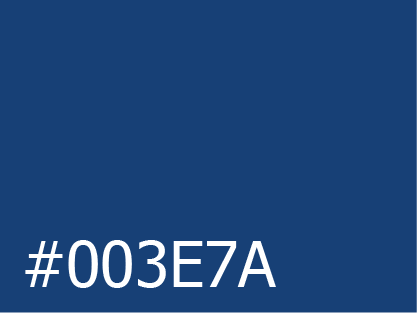
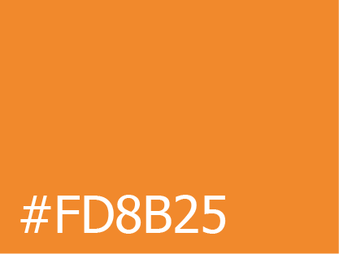
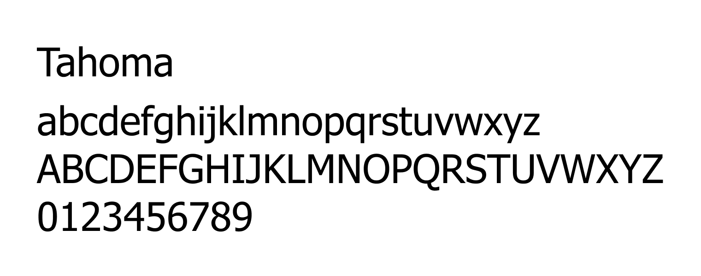

# cahier des charges

## 1. Présentation d’ensemble du projet
### 📄 présentation de l'entreprise :

[TSPO](http://www.tspo.be/)

- entreprise d’électricité générale et industrielle fondée en 2007

Pour l'instant, le site existant est composé de 5 pages.

### 🎯 objectifs :

La refonte du site présente 2 objectifs :

1. Remoderniser le site pour amener plus de trafic en améliorant la présentation des pages et leur contenu.

2. Faciliter la vie des employés en intégrant une section qui leur est réservée et dans laquelle ils peuvent visualiser le planning (et le stock ?) rapidement.

Une application mobile depuis laquelle ils peuvent accéder rapidement au planning (et au stock ?) mais aussi communiquer avec les autres employés et équipe via une messagerie sera également mise en place.

### 👥 cible :

La partie **vitrine** du site s'adresse aux différentes entreprises cherchant à engager un de leurs services. La partie **réservée aux employés** s'adressera évidemment à ces derniers.

### 💡 périmètre du projet :

Le projet comprend 3 principales fonctionnalités :

- présentation de l'entreprise à travers les différentes pages publiques
- possibilité de se connecter à la section réservée aux employés via un compte
- application réservée aux employés

### ✏️ description :

Le projet était une refonte d'un site, il existe déjà un certain nombre de contenus disponibles et utilisables, ainsi qu'un nom de domaine (http://www.tspo.be/) et hébergement.

Les ressources disponibles sont :

- le logo
- les textes de présentation

---

## 2. Description graphique et ergonomique

### 🎨 charte graphique :

Les couleurs du site seront basées sur le logo, bleu (#003E7A) et orange (#FD8B25) et la police utilisée sera Tahoma.

---

## 3. Description fonctionnelle et technique

### 🌳 arborescence :

- la page d'**accueil** :
  - les différents services proposés
  - rapide présentation de l'entreprise qui ramène sur la page de présentation pour plus de détails
  - quelques actualités récentes
- la page de **présentation** :
  - texte de présentation de l'entreprise et son historique
  - présentation des membres de l'équipe
  - présentation des services proposés
- la page d'**actualités** :
  - articles concertant l'entreprise ou le domaine de l'électricité
  - derniers chantiers réalisés
- la page de **contact** :
  - formulaire de contact
  - informations de contact
  - horaires
- la page des **références** : 
  - section regroupant les clients
  - section regroupant les partenaires
  - section regroupant les fournisseurs
- section des **employés** :
  - gestion du planning

### ⚙️ description fonctionnelle :

Sur la partie vitrine du site, l'administrateur pourra mettre à jour les contenus dynamiques (articles, références,...) et récupérer les messages envoyés depuis le formulaire de contact depuis un tableau de bord

Dans la partie réservée aux employés, l'administration comprendra différents rôles qui auront chacun des droits et fonctionnalités différentes :

- le ou les administrateur(s) pourront modifier le planning
- le reste des employés pourront simplement visionner le planning

Pour se connecter, chaque employé disposera d'une adresse email associée à l'entreprise.

L'application mobile nécessitera également une connexion au compte et permettra d'accéder plus facilement au planning, mais disposera aussi d'un système de messagerie entre les employés (ainsi qu'un moyen de contacter directement le bureau de l'atelier depuis le chantier afin de vérifier et recommander du stock ?).

### 📖 informations relatives aux contenus :

— à déterminer

### 🔒 contraintes techniques :

La gestion d'un compte est nécessaire pour la connexion à la section **employés** et à l'application.

L'application doit être disponible à la fois sur IOS et Android.

### 🏷️ mots clés :

- entreprise d’électricité générale et industrielle