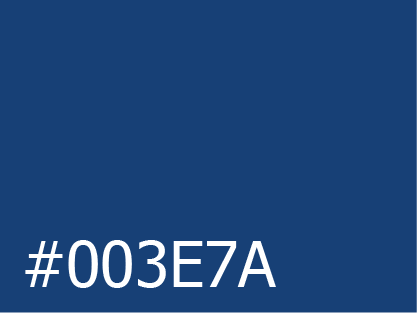
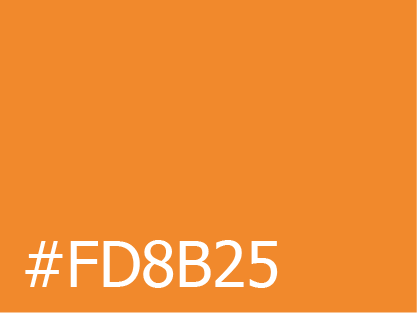
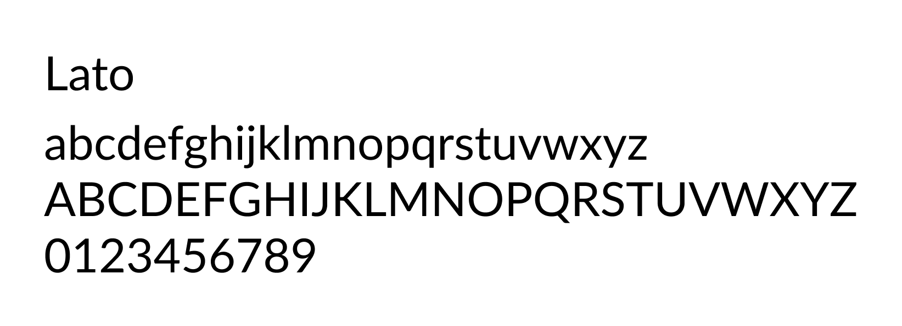

# Cahier des charges (nouvelle version)

## 1. Présentation d’ensemble du projet

### 📄 présentation de l'entreprise :

TSPO est une entreprise d’électricité générale et industrielle fondée en 2007, qui compte aujourd'hui plus de 20
employés. Son [site web original](http://www.tspo.be/) a été créé en 2011.

### 🎯 objectifs :

La refonte du site présente 2 objectifs :

1. Remoderniser le site pour amener plus de trafic en améliorant la présentation des pages et leur contenu.

2. Faciliter la vie des employés en développant un intranet depuis lequel ils peuvent visualiser le planning rapidement.

### 👥 cible :

Le site vitrine s'adresse aux différentes entreprises cherchant à engager un de leurs services.

L'intranet s'adressera évidemment aux employés.

### 💡 périmètre du projet :

Les deux sites seront adaptés pour une utilisation sur des appareils mobiles et seront disponibles exclusivement en
français.

Une attention particulière sera accordée à l'optimisation du planning pour une consultation aisée depuis un téléphone,
étant donné que la plupart des employés ont tendance à consulter leur planning sur leur téléphone portable.

Le client souhaite également récupérer les posts de la page Facebook afin de les intégrer dans une page d'actualités.

### ✏️ description :

Dans le cadre du projet de refonte du site, il existe déjà un certain nombre de contenus disponibles et utilisables,
ainsi qu'un nom de domaine (http://www.tspo.be/) et un hébergement. Ces éléments sont en place au cas où le projet
serait officiellement utilisé par le client.

Cependant, malgré l'existence de contenus existants, il est prévu de les reformuler et de les mettre à jour afin de les
améliorer sur plusieurs aspects tels que la clarté, la précision et l'adéquation aux objectifs du projet de refonte.
Cette étape permettra d'offrir une expérience utilisateur améliorée et de mettre en valeur les nouvelles fonctionnalités
du site.

En ce qui concerne l'intranet, j'utiliserai le fichier Excel actuel comme point de référence pour développer une version
adaptée et améliorée. L'objectif est de prendre en compte les fonctionnalités existantes tout en les optimisant pour l'
intranet, afin de fournir une solution pratique et efficace pour la gestion des plannings des employés.

---

## 2. Description graphique et ergonomique

### 🎨 charte graphique :

Les couleurs du site seront basées sur le logo, bleu (#003E7A) et orange (#FD8B25) et la police utilisée sera Lato, qui
est similaire à Tahoma mais comporte plus de graisses.

Peu après le commencement du projet, j'ai reçu une nouvelle version du logo ayant reçu quelques modifications.

---

## 3. Description fonctionnelle et technique

### 🌳 arborescence :

#### du site vitrine 🖼

- ##### la page d'accueil :
    - présentation de l'entreprise et de ses valeurs
    - présentation des secteurs dans lesquels elle travaille
    - galerie d'images de chantiers mis en avant
    - quelques posts Facebook
- ##### la page à propos :
    - sous-page de présentation
    - sous-page des membres de l'équipe
    - sous-page des partenaires
    - sous-page des certifications
- ##### la page compétences :
    - présentation des compétences, faisant référence aux icônes du logo
- ##### la page références
    - section des chantiers
    - section des clients
- ##### la page de contact
    - formulaires de contact et de demande de devis
    - informations de contact
    - horaires de l'entreprise
- ##### la page d'actualités
    - récupération des posts Facebook
- ##### la page jobs @ TSPO
    - des offres d'emplois avec possibilité de postuler directement sur le site
- ##### la page postuler
    - formulaire de postulation (accessible uniquement via les offres d'emplois)

#### de l'intranet 📊

- ##### la page de connexion :
    - formulaire de connexion au compte
- ##### la page d'accueil :
    - planning de la semaine concernant uniquement l'employé connecté
    - résumé des congés du mois
    - section des annonces du mois
- ##### la page du planning
    - l'ensemble du planning (navigable)
- ##### les pages de création/modification/duplication
    - formulaire (dynamique à l'aide de JavaScript)
- ##### la page de détails
    - les détails d'une entrée du planning
    - les notes reliées au chantier
    - possibilité de supprimer/modifier/dupliquer l'entrée
- ##### la page de profil
    - les informations des informations de l'utilisateur avec possibilité de les modifier
    - un résumé des jours de congés et d'absences de l'utilisateur
- ##### la page de modifications du profil
    - possibilité de modifier sa photo, son nom et prénom et son téléphone
    - possibilité de modifier son mot de passe

### ⚙️ description fonctionnelle :

Sur le site vitrine, l'administrateur aura la possibilité de mettre à jour les contenus dynamiques tels que les partenaires, les références et les offres d'emploi. De plus, il pourra consulter et récupérer les messages envoyés via le formulaire de contact.

Dans l'intranet, l'administrateur disposera de fonctionnalités avancées. Il pourra compléter le planning des employés, marquer les absences, remplir les relevés hebdomadaires, et effectuer d'autres tâches liées à la gestion interne. L'administrateur aura également la possibilité de créer un nouvel utilisateur à partir de son nom et prénom uniquement, puis de lui envoyer les identifiants de connexion par e-mail. Si nécessaire, l'administrateur pourra également créer un profil d'employé associé à cet utilisateur nouvellement créé.

### 🔒 contraintes techniques :

Chaque employé aura accès à une adresse e-mail associée à l'entreprise pour se connecter au système.

Pour assurer la cohérence et éviter la duplication des informations entre les deux sites, il serait souhaitable de pouvoir les relier via une API. Ainsi, les différentes ressources telles que les chantiers, les employés, et autres pourront être partagées et utilisées de manière centralisée. Cette approche facilitera la gestion des données, assurera la synchronisation des informations et évitera les incohérences ou les doublons.

### 🏷️ mots clés :

- entreprise d’électricité générale et industrielle